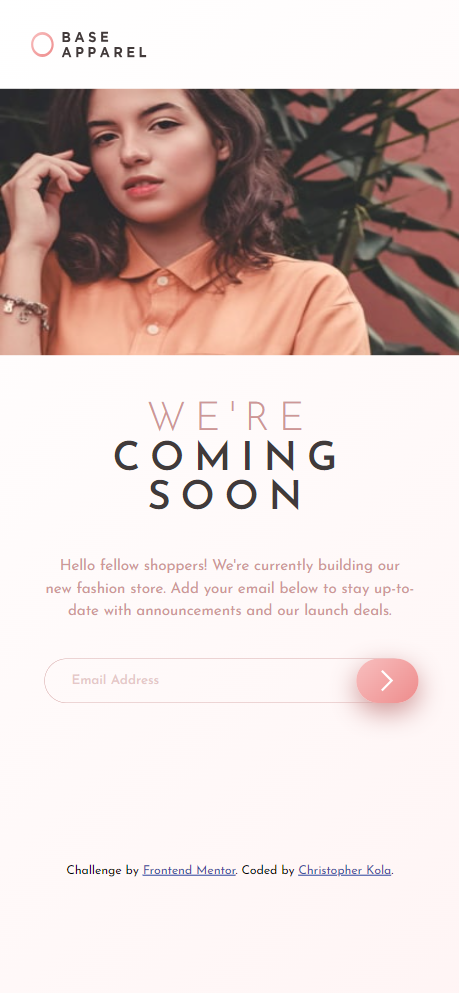

# Frontend Mentor - Base Apparel coming soon page solution

This is a solution to the [Base Apparel coming soon page challenge on Frontend Mentor](https://www.frontendmentor.io/challenges/base-apparel-coming-soon-page-5d46b47f8db8a7063f9331a0). Frontend Mentor challenges help you improve your coding skills by building realistic projects.

## Table of contents

- [Overview](#overview)
  - [The challenge](#the-challenge)
  - [Screenshot](#screenshot)
  - [Links](#links)
- [My process](#my-process)
  - [Built with](#built-with)
  - [What I learned](#what-i-learned)
  - [Continued development](#continued-development)
  - [Useful resources](#useful-resources)
- [Author](#author)

## Overview

### The challenge

Users should be able to:

- View the optimal layout for the site depending on their device's screen size
- See hover states for all interactive elements on the page
- Receive an error message when the `form` is submitted if:
  - The `input` field is empty
  - The email address is not formatted correctly

### Screenshot

#### Mobile view


#### Desktop view


### Links

- Solution URL: [solution URL here](https://ckola99.github.io/coming-soon-page/)
- Live Site URL: [live site URL here](https://www.frontendmentor.io/solutions/base-apparel-coming-soon-page-built-with-html-css-and-javascript-vlMrePg32N)

## My process

### Built with

- Semantic HTML5 markup
- CSS custom properties
- Flexbox
- CSS Grid
- Mobile-first workflow

### What I learned

I used different selectors and I reinforced my skills and knowledge in CSS grid and flexbox. I also learned how to use the transition correctly

```css
button:hover {
	cursor: pointer;
	transform: scale(1.1);
	transition: transform ease-out 0.3s;
}
```

### Continued development

I hope to get better at animations and make more interesting pages with animations.

### Useful resources

-[ChatGPT.com](https://chatgpt.com/) - good use for menial jobs.
-MDN

## Author

- Frontend Mentor - [@Ckola99](https://www.frontendmentor.io/profile/Ckola99)
- Twitter - [@Kola.Dev](https://www.twitter.com/Koladev01)
